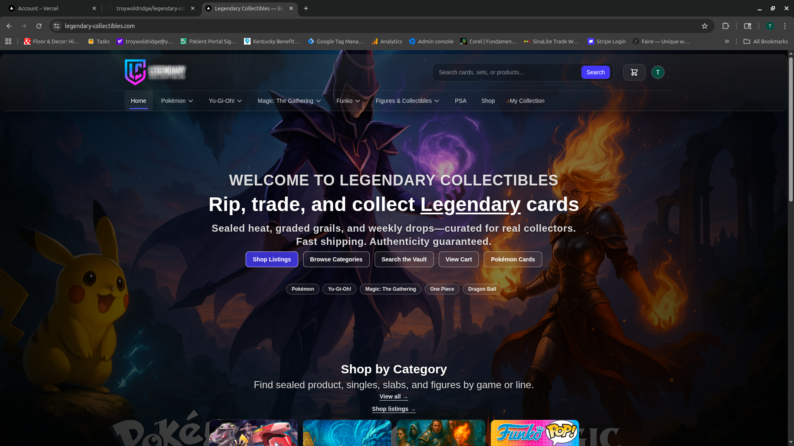
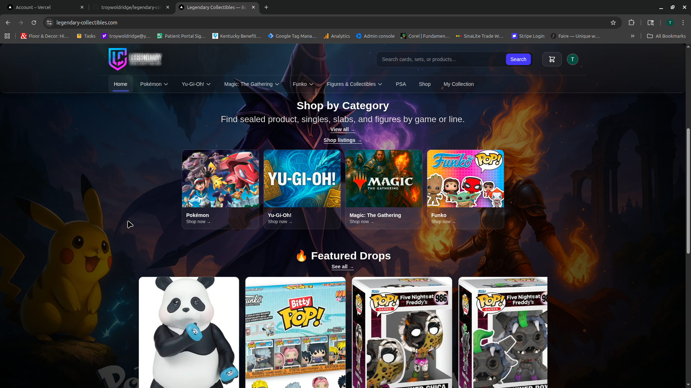
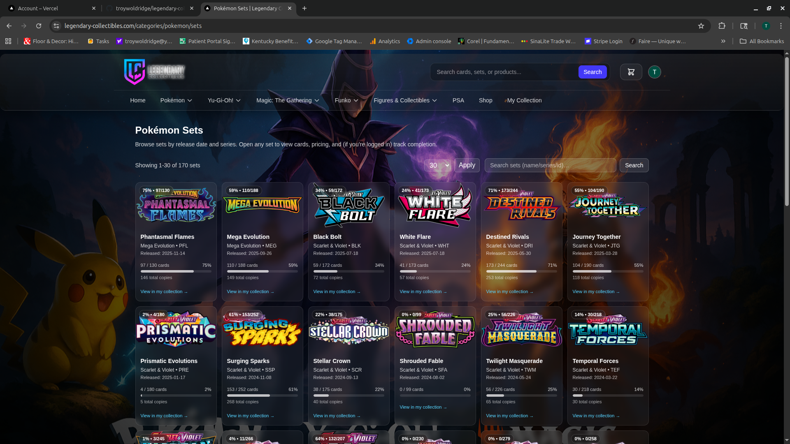
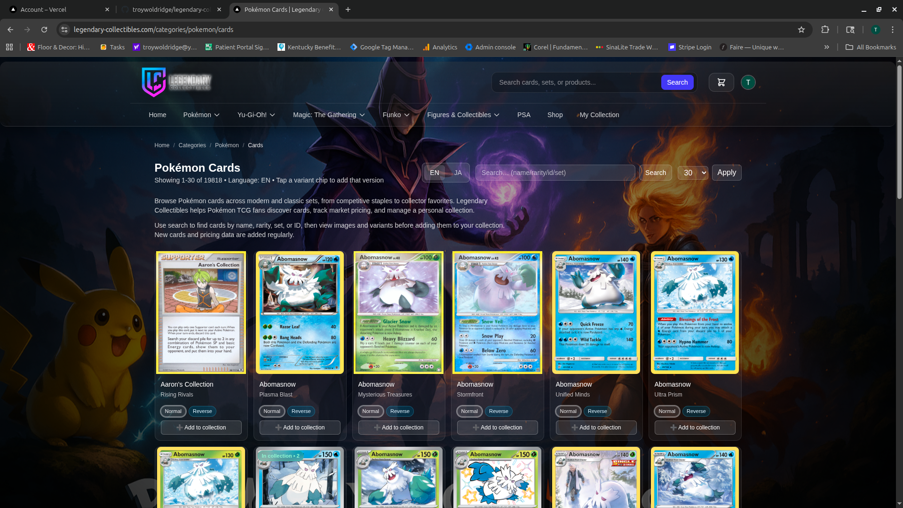
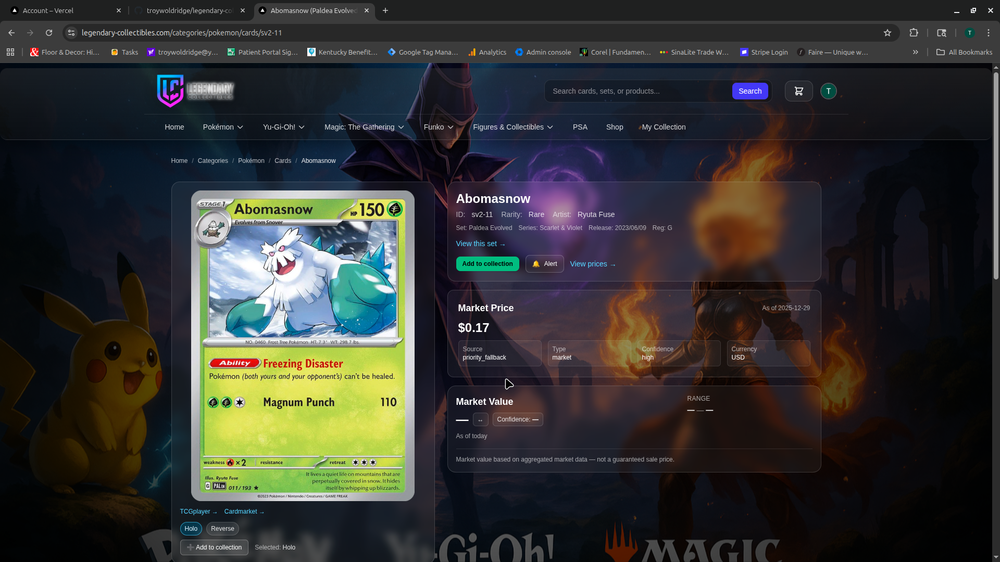
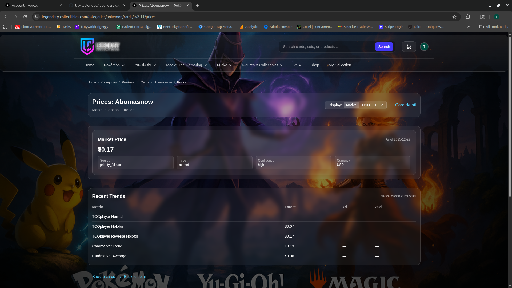
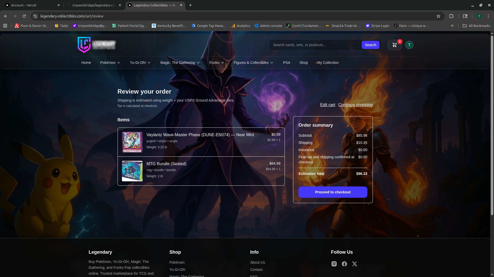
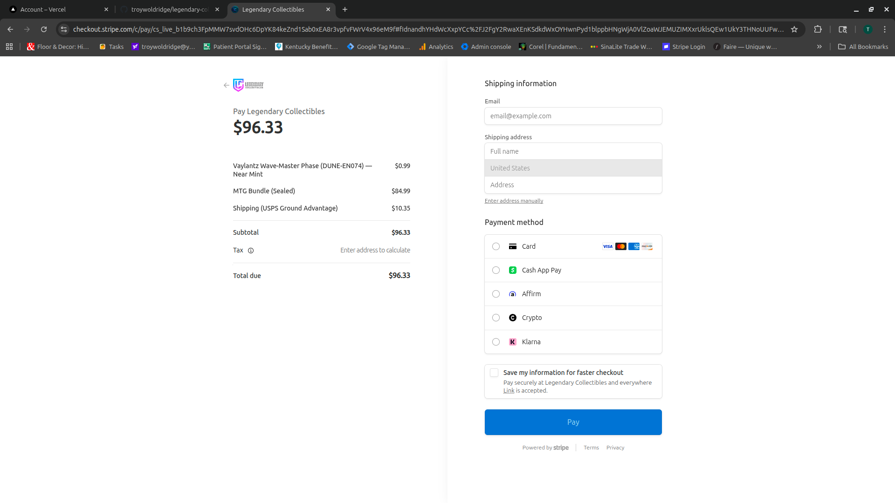

# Legendary Collectibles — Showcase


A **public-safe portfolio showcase** for the **Legendary Collectibles** platform: product experience, data pipelines, and the architecture behind pricing + collection valuation.

> This repo intentionally contains **no secrets** and excludes private integration details.

---

## Live project
- https://legendary-collectibles.com

---

## What this repo shows
- A production-style **catalog + collection** experience (browse → detail → pricing → cart → checkout)
- A **PostgreSQL-first** platform with snapshot/rollup tables for speed + history
- Scripted **data pipelines** (import → normalize → rollup → alerts/revalue)
- A real checkout flow using **Stripe**
- Operational discipline: validations, safety checks, and repeatable runs

---

## Tech stack (high level)
- **Frontend:** Next.js (App Router), React
- **Backend:** Next.js Route Handlers (API) + Node.js scripts (pipelines)
- **Database:** PostgreSQL (Drizzle ORM)
- **Auth:** Clerk
- **Payments:** Stripe
- **Images:** Cloudflare Images
- **Ops:** Linux server + process monitoring + scheduled jobs

---

## Documentation
- **Architecture:** `docs/ARCHITECTURE.md`
- **Data pipelines:** `docs/PIPELINES.md`
- **Deployment/ops:** `docs/OPS.md`
- **Security & secrets:** `docs/SECURITY.md`

Related repos:
- `legendary-data-pipeline` — curated public pipeline scripts
- `legendary-utils` — reusable DB/feeds/diagnostics utilities

---

## Screenshots

### Home


### Category discovery


### Browse sets


### Browse cards


### Card detail


### Pricing + trends


### Cart review


### Stripe checkout


---

## Architecture

```mermaid
flowchart LR
  U[User / Collector] -->|Browse / Search| WEB[Next.js Web App]
  U -->|Sign in| AUTH[Clerk Auth]
  WEB -->|Reads/Writes| DB[(PostgreSQL)]
  WEB -->|Images| CF[Cloudflare Images]
  WEB -->|Checkout| STRIPE[Stripe Checkout]

  subgraph Data_Pipelines[Data Pipelines (Node scripts)]
    INGEST[Import / Ingest] --> NORM[Normalize / Map IDs]
    NORM --> ROLLUP[Daily Rollups + Current Views]
    ROLLUP --> ALERTS[Price Alerts + Revalue Jobs]
  end

  INGEST --> DB
  NORM --> DB
  ROLLUP --> DB
  ALERTS --> DB

  DB --> WEB
```

## Notes
Postgres is the source of truth for catalog, pricing, collection state, and snapshots.

Pipelines are designed to be repeatable (import → normalize → rollup → serve).

Checkout is handled via Stripe, while media is delivered via Cloudflare Images.

Full diagram page: [diagrams/architecture.md](diagrams/architecture.md)
