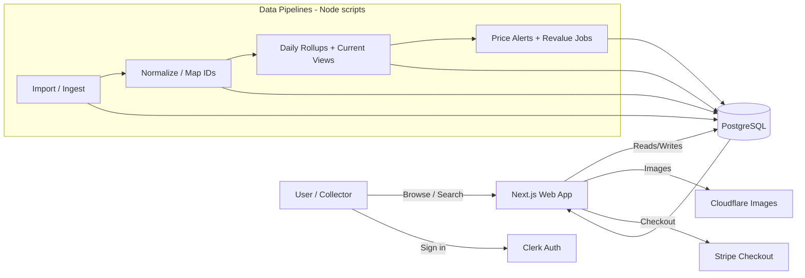

# Architecture Diagram




# Notes
Postgres is the source of truth for catalog, pricing, collection state, and snapshots.

Pipelines are designed to be repeatable (import → normalize → rollup → serve).

Checkout is handled via Stripe, while media is delivered via Cloudflare Images.

---

## Pricing & Valuation Data Flow

```mermaid
flowchart TB
  %% --- Sources ---
  subgraph SOURCES[External Sources]
    PC[PriceCharting CSV]
    SF[Scryfall API]
    TCG[TCGplayer + Cardmarket feeds]
    EB[eBay active + sold comps]
  end

  %% --- Ingest / Normalize ---
  subgraph PIPE[Pipeline Scripts]
    ING[Import / Ingest]
    MAP[Normalize + Map IDs]
    CONF[Confidence + Source Priority]
    ROLL[Rollups daily]
  end

  %% --- Tables ---
  subgraph DBT[Postgres Tables]
    MI[(market_items)]
    MEI[(market_item_external_ids)]
    MPC[(market_prices_current)]
    MPD[(market_price_daily)]
    MPS[(market_price_snapshots)]
    MSC[(market_sales_comps)]
    MVD[(market_values_daily)]

    UCI[(user_collection_items)]
    UCIV[(user_collection_item_valuations)]
    UCDV[(user_collection_daily_valuations)]
    JOBS[(user_revalue_jobs)]

    ALERTS[(price_alerts)]
  end

  %% --- App layer ---
  subgraph APP[Next.js App]
    UI[Browse / Detail / Pricing Pages]
    COL[My Collection + Alerts]
  end

  %% --- Source → ingest ---
  PC --> ING
  SF --> ING
  TCG --> ING
  EB --> ING

  %% --- ingest → tables ---
  ING --> MI
  ING --> MEI
  EB --> MSC

  %% --- normalize / mapping ---
  MI --> MAP
  MEI --> MAP
  MSC --> MAP

  %% --- confidence / source priority ---
  MAP --> CONF
  CONF --> MPC

  %% --- rollups / history ---
  MPC --> ROLL
  ROLL --> MPD
  ROLL --> MPS
  ROLL --> MVD

  %% --- valuations / revalue jobs ---
  MVD --> UCIV
  UCI --> UCIV
  UCIV --> UCDV
  JOBS --> UCIV

  %% --- alerts ---
  MPC --> ALERTS
  ALERTS --> COL

  %% --- app reads ---
  MPC --> UI
  MPD --> UI
  MPS --> UI
  MSC --> UI
  UCI --> COL
  UCIV --> COL
  UCDV --> COL

---

## Pricing and Valuation Data Flow (Polished)

```mermaid
flowchart TB
  %% Grouping: Sources -> Pipeline -> Tables -> App

  subgraph SOURCES[External Sources]
    PC[PriceCharting CSV]
    SF[Scryfall API]
    TCG[TCGplayer and Cardmarket feeds]
    EB[eBay active and sold comps]
  end

  subgraph PIPE[Pipeline Scripts]
    ING[Import and Ingest]
    MAP[Normalize and Map IDs]
    CONF[Confidence and Source Priority]
    CUR[Build Current Prices]
    ROLL[Rollups daily]
  end

  subgraph TABLES[Postgres Tables]
    MI[(market_items)]
    MEI[(market_item_external_ids)]
    MSC[(market_sales_comps)]

    MPC[(market_prices_current)]
    MPD[(market_price_daily)]
    MPS[(market_price_snapshots)]
    MVD[(market_values_daily)]

    UCI[(user_collection_items)]
    UCIV[(user_collection_item_valuations)]
    UCDV[(user_collection_daily_valuations)]
    JOBS[(user_revalue_jobs)]

    ALERTS[(price_alerts)]
  end

  subgraph APP[Next.js App]
    UI[Browse and Pricing Pages]
    COL[My Collection and Alerts]
  end

  %% Sources -> pipeline
  PC --> ING
  SF --> ING
  TCG --> ING
  EB --> ING

  %% Pipeline -> base tables
  ING --> MI
  ING --> MEI
  EB --> MSC

  %% Normalize
  MI --> MAP
  MEI --> MAP
  MSC --> MAP

  %% Current prices
  MAP --> CONF
  CONF --> CUR
  CUR --> MPC

  %% Rollups for history
  MPC --> ROLL
  ROLL --> MPD
  ROLL --> MPS
  ROLL --> MVD

  %% Collection valuation
  UCI --> UCIV
  MVD --> UCIV
  JOBS --> UCIV
  UCIV --> UCDV

  %% Alerts
  MPC --> ALERTS
  ALERTS --> COL

  %% App reads
  MPC --> UI
  MPD --> UI
  MPS --> UI
  MSC --> UI
  MVD --> UI
  UCI --> COL
  UCIV --> COL
  UCDV --> COL
```

### Mini legend
- **market_prices_current** powers fast price reads in the UI.
- **market_price_daily** and **market_price_snapshots** support history and trend views.
- **market_values_daily** feeds collection valuation and reporting.
- **price_alerts** stores watcher rules and triggers.
